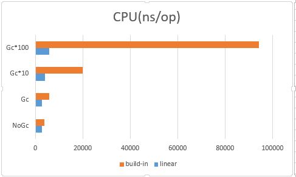

# Lac - Linear Allocator for Golang

## Goal
Speed up the memory allocation and improve the GC performance, especially for dynamic-memory-heavy applications.

NOTE: current version need go1.18+.

## Potential Use cases
1. A large amount of memory never needs to be released. (global configs, read-only assets like navmesh)
2. Massive temporary objects with deterministic lifetime. (protobuf objects send to network)

## Highlights
Linear allocator:

1. Mush faster on memory allocating. An allocation is just a pointer advancement internally.
2. Can greatly reduce the object marking pressure of GC. Lac is just a few byte arrays internally.
3. More general. Lac can allocate various types of objects.
4. Much simpler and faster on reclaiming memories. No need to manually release every object back but just reset the allocation cursor.
5. Much cheaper. Lac reuse memory chunks among each other via chunk pool. 
6. Memory efficient. Memories are more compact, CPU cache-friendly.
7. Allows build-in allocated objects to be attached to the Lac allocated objects. 
8. Support concurrency.
9. Provide protobuf2 like APIs.


## Limitations
1. Never store pointers to build-in allocated objects into Lac allocated objects **directly**. (There's a debug mode for checking external pointers)
2. Never store or use pointers to Lac allocated objects after the allocator is released. (In debug mode, the allocator traverses the objects and obfuscate the pointers to make any attempting usage panic)
3. Map memory can't use Lac and fallback to build-in allocator.


# Pros over v1.20 arena
1. Faster(see benchmark results below).
2. Support concurrency.
3. Slice append can utilize Lac as well.
4. Support debugging mode.
5. Provide protobuf2 like APIs.
6. Completely pointer free (no pointer bitmap initializing, no GC marking, etc).
7. Do not zero slices by default.

## Usage

```go
type PbItem struct {
	Id     *int
	Price  *int
	Class  *int
	Name   *string
	Active *bool
}

type PbData struct {
	Age   *int
	Items []*PbItem
	InUse *PbItem
}

func main() {	
	ac := lac.Get()
	defer ac.Release()
	
	d := lac.New[PbData](ac)
	d.Age = ac.Int(11)

	n := 3
	for i := 0; i < n; i++ {
		item := lac.New[PbItem](ac)
		item.Id = ac.Int(i + 1)
		item.Active = ac.Bool(true)
		item.Price = ac.Int(100 + i)
		item.Class = ac.Int(3 + i)
		item.Name = ac.String("name")

		d.Items = Append(ac, d.Items, item)
	}
}
```

## Benchmarks
Results from benchmark tests:

### GC overhead


### A simple test shows allocation performance compared with v1.20 arena.
```
cpu: Intel(R) Core(TM) i7-10510U CPU @ 1.80GHz
Benchmark_RawMallocSmall
Benchmark_RawMallocSmall-8       8049346               159.2 ns/op
Benchmark_LacMallocSmall
Benchmark_LacMallocSmall-8      10938076                96.29 ns/op
Benchmark_ArenaMallocSmall
Benchmark_ArenaMallocSmall-8     9400137               136.4 ns/op
Benchmark_RawMallocLarge
Benchmark_RawMallocLarge-8         35022             34329 ns/op
Benchmark_LacMallocLarge
Benchmark_LacMallocLarge-8         51916             25429 ns/op
Benchmark_ArenaMallocLarge
Benchmark_ArenaMallocLarge-8       26605             48399 ns/op
```

### Latencies under extreme allocation pressure, compared with build-in allocator.  
``` 
Benchmark_LinearAc
>> Latency: max=944ms, avg=6ms.
Benchmark_LinearAc-8                   1        9589733200 ns/op
Benchmark_buildInAc
>> Latency: max=3535ms, avg=7ms.
Benchmark_buildInAc-8                  1        7651476400 ns/op
```

